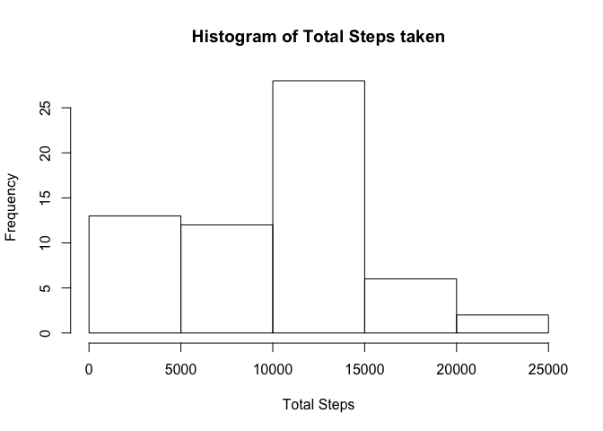
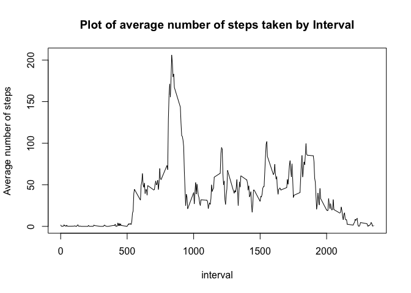
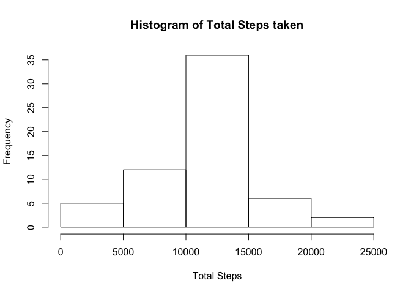

# Reproducible Research: Peer Assessment 1


## Loading and preprocessing the data

```r
  ##loading required libraries
  library(dplyr)
```

```
## 
## Attaching package: 'dplyr'
## 
## The following object is masked from 'package:stats':
## 
##     filter
## 
## The following objects are masked from 'package:base':
## 
##     intersect, setdiff, setequal, union
```

```r
  library(datasets)
  library(lattice)

  ##loading data
  data <- read.csv("./activity.csv")

  ##changing Dates from factor to Date class objects
  data$date <- as.Date(data$date)
```
  
  
## What is mean total number of steps taken per day?


```r
  ##table containing the total number of steps for    each day
  total_steps <- summarise(group_by(data, date), t_steps = sum(steps, na.rm = TRUE))

  ##plotting histogram
  with(total_steps, hist(t_steps, main = "Histogram of Total Steps taken", xlab = "Total Steps"))
```

 

```r
  ##calculate the mean and median total number of steps taken per day
  
  summary_total_steps <- summary(total_steps$t_steps)
  median_total_steps <- summary_total_steps[3]
  mean_total_steps <- summary_total_steps[4]
```

The <b>mean</b> and <b>median</b> total number of steps taken per day are respectively 9354 and 10400

## What is the average daily activity pattern?

```r
  ##table containing the total number of steps for    each interval
  total_steps_interval <- summarise(group_by(data, interval), t_steps = sum(steps, na.rm = TRUE))

  ##time series plot
  with(total_steps_interval, plot(interval, t_steps, type = "l", main = "Plot of average number of steps taken by Interval", ylab = "Average number of steps"))
```

 

```r
  ##5 minute interval with maximum number of steps
  max_total_steps_interval <- total_steps_interval[which(total_steps_interval$t_steps == max(total_steps_interval$t_steps)),1]
```

The <b>835</b> interval contains the maximum number of steps(<b>10927</b>)

## Inputing missing values

```r
  ##calculate the sum of missing values
  sum_nas <- sum(is.na(data$steps))
```

There are <b>2304</b> missing values in the data set


```r
  ##filling in all of the missing values in the      dataset using the mean value for that 5-minute interval.
  new_data <- data
  new_data[is.na(data$steps),1] <- total_steps_interval[total_steps_interval == new_data[is.na(new_data$steps),3], 2]

  ##new table containing the total number of steps for each day
  new_total_steps <- summarise(group_by(new_data, date), t_steps = sum(steps, na.rm = TRUE))

  ##plotting histogram
  with(new_total_steps, hist(t_steps, main = "Histogram of Total Steps taken", xlab = "Total Steps"))
```

 

```r
  ##calculate the mean and median total number of   steps taken per day
  
  new_summary_total_steps <- summary(new_total_steps$t_steps)
  new_median_total_steps <- new_summary_total_steps[3]
  new_mean_total_steps <- new_summary_total_steps[4]
```

The <b>mean</b> and <b>median</b> total number of steps taken per day are respectively <b>84190</b> and <b>11460</b>

  Yes the values of the mean and median differ from previous estimates.
  Inputting missing values results in an <b>higher mean and median</b> for the total number of steps taken.

## Are there differences in activity patterns between weekdays and weekends?


```r
  ##add new factor to new data table, setting the default as weekday
  new_data <- mutate(new_data, when = "weekday")

  ##adjust to change weekend values to weekend using regex
  weekend_grep <- grep("^Sat|^Sun", weekdays(new_data$date))
  new_data[weekend_grep, 4] <- "weekend"

  ##new dataset showing average number of steps taken averaged across all weekday days or weekend days
  week_total_steps <- transform(week_total_steps, when = factor(when))

  xyplot(t_steps ~ interval | when, data = week_total_steps, layout = c(1, 2), type = "l", ylab = "Number of steps", xlab = "Interval")
```

 
